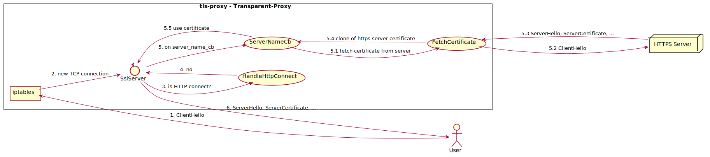
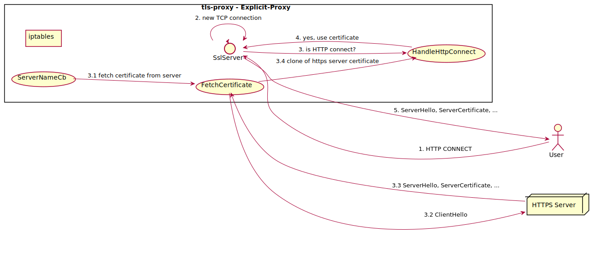
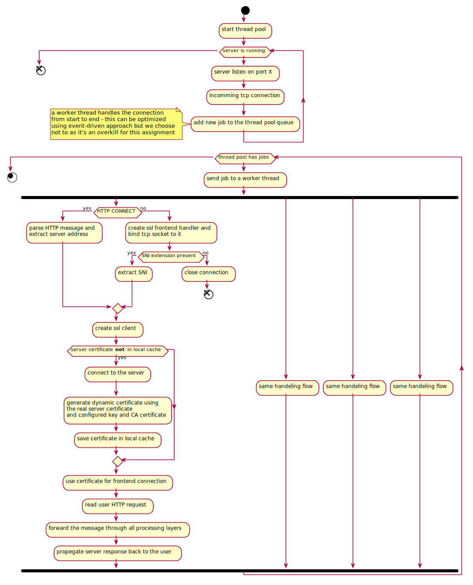

# tls-proxy
This project aims to demonstrate understanding in:
* SSL/TLS Protocol
* X509 Certificates
* Proxy Servers

## How it works?
The proxy imitates a Men-In-The-Middle attack by hijacking the connection a **Client** is initiating to a **Server** and impersonate itself as the server.

This is being achieved in one of the following ways:
1. Transparent-Proxy:
   
   In this mode of operation, the user has no idea that the connection is being intercepted by a proxy. In this mode of operation we redirect the client traffic to the proxy using a `iptables` manipulation and install the Root CA Certificate used by the proxy to generate On-The-Fly certificates as a trusted CA in the client's OS.
   

2. Explicit-Proxy:
   
   The client explicitly uses the proxy server by issuing a *HTTP CONNECT* request to the server and then change the connection to a HTTPS connection.
   

### On-The-Fly Certificate Generation:
In order for the server to generate valid x509 certificates and do it fast, the proxy server need to have 2 items:
1. Root CA Certificate file in PEM format - will be used to sign all the generated certificates.
2. Key-Pair file in PEM format - will be used as the key for all the generated certificates.

In order for the server to operate both in Transparent and Explicit modes, we use the ability to peek into TCP packets.

Serving server certificate to the HTTPS client includes the following steps:
1. Server listen for new TCP connections
2. On new TCP connection:
   * Peek the incoming TCP socket and see if the word **"HTTP"** is found in the first 4 bytes.
      * If found - extract the server name listed in the *HTTP CONNECT* request *uri*:
         * If a matching certificate exist in the cache load it.
         * Else, start a backend ssl connection to server, generate a new certificate using the server certificate and store it in the cache
         * Use the certificate for the frontend connection.
         * Notify that a dynamic certificate was used.
      * Else, do nothing.
3. Check if a dynamic certificate is being used:
   * If true, finish the handshake with the client and initiate a connection to the server.
   * Else, read the ClientHello:
      * If the ClientHello contains SNI extension:
         * If a matching certificate exist in the cache load it.
         * Else, start a backend ssl connection to server, generate a new certificate using the server certificate and store it in the cache
         * Use the certificate for the frontend connection.
      * Else, drop the connection.
   * Finish the handshake with the client and initiate a connection to the server.
4. Handle HTTPS connection.

## Activity Diagram:


## Main Modules:
### SslSever:
This class is the entry point to any incoming connection.
It contains the thread pool, the logic to handle incoming connections, fetching dynamic certificates and callback to handle SNI extensions.
On a new connection, a new job is added to the thread pool which manages the worker threads.

The job consist of figuring out if the connection is HTTP CONNECT (Explicit-Proxy) or SSL ClientHello (Transparent-Proxy) and generating the dynamic certificate accordingly.
Another thing that happens at the start of the new job is creating the chain of processing layers (HandlerLayer).

Processing layers in this example are:

**FrontendSslLayer** -> **LogHttpLayer** -> **HttpRewriteLayer** -> **BackendSslLayer**

### SslClient:
This class is responsible to create backend TCP connection as well as configuring the SSL Context used by the backend connection.
Once done, the SslClient create the `BackendSslLayer` and starts backend connection to the server.

### HandlerLayer:
HandlerLayer is an abstract class used to create a chain of handler that will process a request from start to finish.
This chain is also known as `Chain-Of-Responsibility Design Pattern` and is being used ny most modern servers and routing frameworks.
In our project, there are 4 HandlerLayers:
1. **FrontendSslLayer** - Responsible on the SSL connection with the user.
2. **BackendSslLayer** - Responsible on the SSL connection with the server.
3. **LogHttpLayer** - Responsible on the logging of HTTP messages.
4. **HttpRewriteLayer** - Responsible to change/add `Connection` http header to `Close` as we are supporting only 1 request and the corresponding response.

## Building:
### Perquisites:
1. `cmake >= 3.10`
2. `openssl >= 1.1.1`
3. `ubuntu >= 18.04 LTS`
4. `g++ >= 7.4.0`
5. `curl >= 7.58.0`

### Build Steps:
1. Run `./scripts/build.sh clean`.
2. `tls-proxy` binary file can be found at `./build/` directory.


## Running:
To run the proxy server, use `./scripts/run_proxy.sh --ip <ip to bind>`.

To choose an IP for the server to bind to, you can use `ifconfig` command when using linux, find the main IP address used by your machine and choose an available IP from the same subnet (there is an example below in the explanation on the `--ip` flag).

The script will setup some `iptables` rules to forward all traffic destined to TCP port 443 to the proxy server.

The scripts accepts the following flags:
* `--mode` - Set the mode of the proxy server.
  
  Possible values are:
  * **1** - Explicit Proxy Only
  * **2** - Transparent and Explicit Proxy
  
  Default value is **2**.
* `--ip` - Set the listening IP of the proxy server. The script will create a new interface named `tls_proxy` and the proxy server will use it for connections.
  
  There is no default value and you must supply an ip.

  This ip should be accessible from the outside network.

  **Example**: If your main ip address is `192.168.1.1`, you can use `192.168.1.2` (if it is avaiable).
* `--port` - Set the listening port of the proxy server.
  
  The default value is `5443`.
* `--ca` - Set the Root CA certificate to be used by the server to sign the dynamic certificates and set it also at the operating system trusted CA Store.
  
  The default value is `./scerts/ca_cert.pem`.

* `--key` - Set the key-pair to be used for the dynamic certificates.
  
  The default value is `./scerts/key.pem`.
* `--ciphersuites` - Set the ciphersuites the server will use for incoming connections. See details on how ciphersuites string should look like [here](https://www.openssl.org/docs/man1.1.1/man1/ciphers.html).
  
  The default value is `ALL`.

## How to test it?
### Transparent-Proxy
Start the server using `./scripts/run_proxy.sh --ip <ip to bind> --mode 2`.
Now open a different shell for the client.

* **RSA Certificate** - `curl https://rsa2048.badssl.com -o /dev/null --verbose --trace session.log; grep "Server certificate" -A6 session.log`.

**Expected output**:
```
== Info: Server certificate:
== Info:  subject: C=US; ST=California; L=Walnut Creek; O=Lucas Garron Torres; CN=*.badssl.com
== Info:  start date: Mar 23 00:00:00 2020 GMT
== Info:  expire date: May 17 12:00:00 2022 GMT
== Info:  subjectAltName: host "rsa2048.badssl.com" matched cert's "*.badssl.com"
== Info:  issuer: C=IL; ST=Some-State; O=DROR
== Info:  SSL certificate verify ok.
```

* **EC Certificate** - `curl https://ecc256.badssl.com -o /dev/null --verbose --trace session.log; grep "Server certificate" -A6 session.log`.

**Expected output**:
```
== Info: Server certificate:
== Info:  subject: C=US; ST=California; L=Walnut Creek; O=Lucas Garron Torres; CN=*.badssl.com
== Info:  start date: Feb  5 00:00:00 2020 GMT
== Info:  expire date: Feb 10 12:00:00 2022 GMT
== Info:  subjectAltName: host "ecc256.badssl.com" matched cert's "*.badssl.com"
== Info:  issuer: C=IL; ST=Some-State; O=DROR
== Info:  SSL certificate verify ok.
```


### Explicit-Proxy
Start the server using `./scripts/run_proxy.sh --ip <ip to bind> --mode 1` (in this example we used `192.168.244.1`).
Now open a different shell for the client.

Using the same commands from the example of the **Transparent-Proxy** will not work as in this case there are no `iptables` rules configured.
Simple example of when to use an explicit proxy is if the port used is non-standard **443** port.

Trying  this `curl https://tls-v1-2.badssl.com:1012 -o /dev/null --verbose --trace session.log; grep "Server certificate" -A6 session.log` will not use the proxy.

**Example output**:
```
== Info: Server certificate:
== Info:  subject: C=US; ST=California; L=Walnut Creek; O=Lucas Garron Torres; CN=*.badssl.com
== Info:  start date: Mar 23 00:00:00 2020 GMT
== Info:  expire date: May 17 12:00:00 2022 GMT
== Info:  subjectAltName: host "tls-v1-2.badssl.com" matched cert's "*.badssl.com"
== Info:  issuer: C=US; O=DigiCert Inc; CN=DigiCert SHA2 Secure Server CA
== Info:  SSL certificate verify ok.
```

So use explicitly - `curl https://tls-v1-2.badssl.com:1012 -o /dev/null --verbose --trace session.log --proxy1.0 http://192.168.244.1:5443; grep "Server certificate" -A6 session.log`.

**Example output**:
```
== Info: Server certificate:
== Info:  subject: C=US; ST=California; L=Walnut Creek; O=Lucas Garron Torres; CN=*.badssl.com
== Info:  start date: Mar 23 00:00:00 2020 GMT
== Info:  expire date: May 17 12:00:00 2022 GMT
== Info:  subjectAltName: host "tls-v1-2.badssl.com" matched cert's "*.badssl.com"
== Info:  issuer: C=IL; ST=Some-State; O=DROR
== Info:  SSL certificate verify ok.
```


In the output of both cases you can see that the `issuer` matches the `subject` of the certificate that was set using `--ca`.
